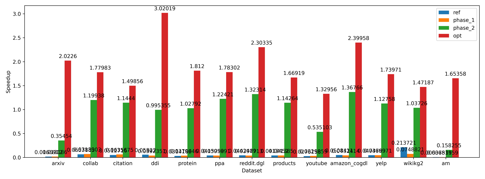
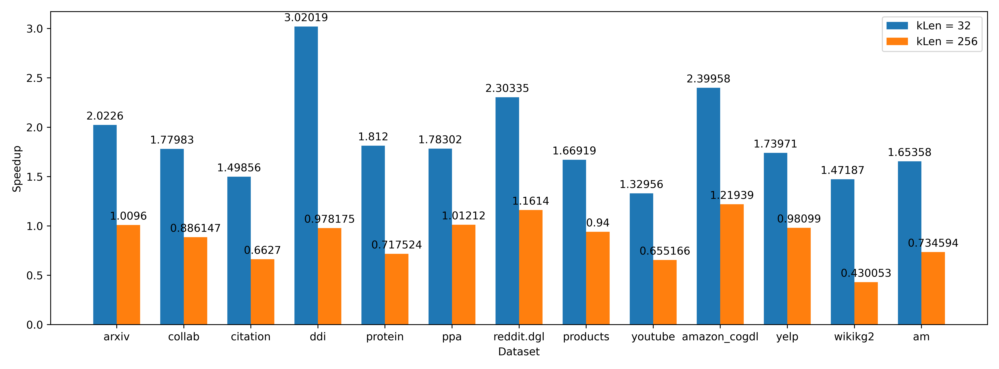

# PA4: 稀疏矩阵-矩阵乘

## 优化策略

### warp divergence

ref 实现中的 warp divergence 主要是因为将不同行归入一个 warp 计算, 而不同行的 NNZ 可能有很大差异, 产生 warp divergence. 因此, 只要避免将不同行划入同一 warp 即可. 因此, 令 `block.x = 1`, 使每个 thread block 至多处理一行数据.

如图中 ref 与 phase_1 对比, 提升有限.

### shared memory

在 SpMM 中, 稀疏矩阵的一个元素代表了对于稠密矩阵的一行的访问. 因此可以将稀疏矩阵的一部分缓存在 shared memory 中, 以减少重复从 global memory 中读取稀疏矩阵.

如图中 phase_2, 效果拔群.

### load imbalance

稀疏矩阵不同行的 NNZ 可能有很大差异, 因此考虑将较大的行进一步划分, 将稀疏矩阵的一行分割为多个 `Task`, 分配到多个线程中处理, 再使用 `atomicAdd` 归约. 为了减少同一行被连续线程处理导致 atomic 冲突频繁, 我们可以将 `Task` 打乱.

如图中 opt, 获得了进一步提升.

## Performance

### `kLen = 32`

| Dataset      | ref time    | opt time    | speedup            |
| ------------ | ----------- | ----------- | ------------------ |
| arxiv        | 0.000772655 | 0.000382011 | 2.0225988256882657 |
| collab       | 0.00133105  | 0.000747854 | 1.7798260088199034 |
| citation     | 0.0164488   | 0.0109764   | 1.4985605480849822 |
| ddi          | 0.000705377 | 0.000233554 | 3.0201880507291676 |
| protein      | 0.0246445   | 0.0136007   | 1.8120023234098244 |
| ppa          | 0.0183861   | 0.0103118   | 1.783015574390504  |
| reddit.dgl   | 0.0486643   | 0.0211276   | 2.303352013479998  |
| products     | 0.0558278   | 0.0334461   | 1.669187139905699  |
| youtube      | 0.00364472  | 0.00274129  | 1.3295638184942127 |
| amazon_cogdl | 0.125264    | 0.0522025   | 2.399578564245007  |
| yelp         | 0.00658028  | 0.00378241  | 1.7397056374110687 |
| wikikg2      | 0.00714436  | 0.00485393  | 1.4718712465981172 |
| am           | 0.00374     | 0.00226176  | 1.6535795132993776 |

### `kLen = 256`

| Dataset      | ref time   | opt time   | speedup            |
| ------------ | ---------- | ---------- | ------------------ |
| arxiv        | 0.0030007  | 0.00297216 | 1.0096024440137812 |
| collab       | 0.00520226 | 0.00587065 | 0.8861471898341752 |
| citation     | 0.0788706  | 0.119014   | 0.6627001865326768 |
| ddi          | 0.00156062 | 0.00159544 | 0.978175299603871  |
| protein      | 0.0808061  | 0.112618   | 0.7175238416594151 |
| ppa          | 0.0849794  | 0.0839621  | 1.0121161809911854 |
| reddit.dgl   | 0.202341   | 0.174222   | 1.1613975272927644 |
| products     | 0.258469   | 0.274967   | 0.9400000727360011 |
| youtube      | 0.0144181  | 0.0220068  | 0.6551656760637621 |
| amazon_cogdl | 0.517086   | 0.424054   | 1.2193871535229006 |
| yelp         | 0.029976   | 0.0305569  | 0.980989563731923  |
| wikikg2      | 0.0166503  | 0.0387169  | 0.4300525093692935 |
| am           | 0.0134264  | 0.0182773  | 0.7345942781483041 |
