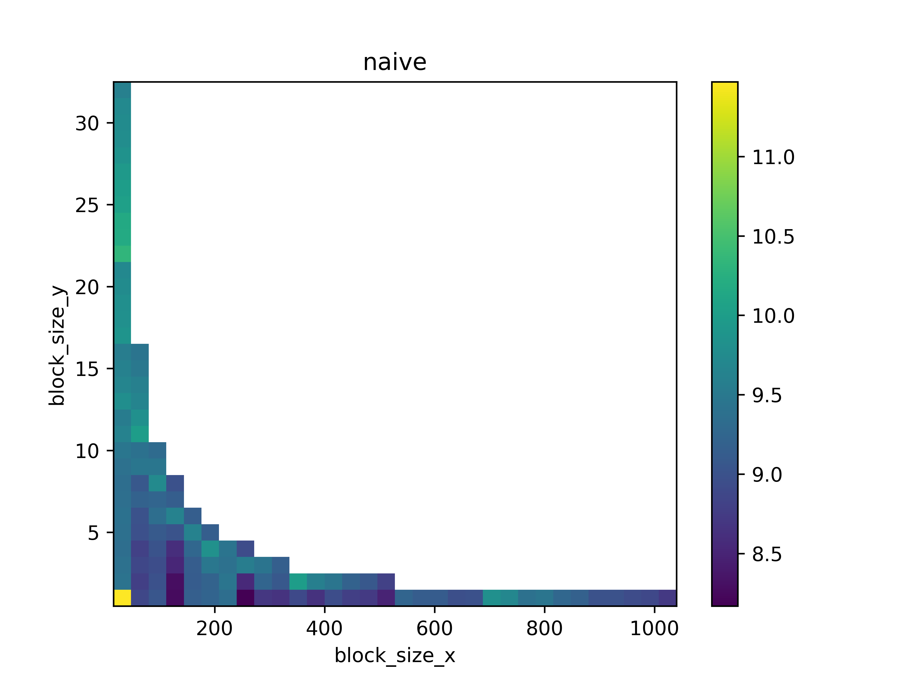
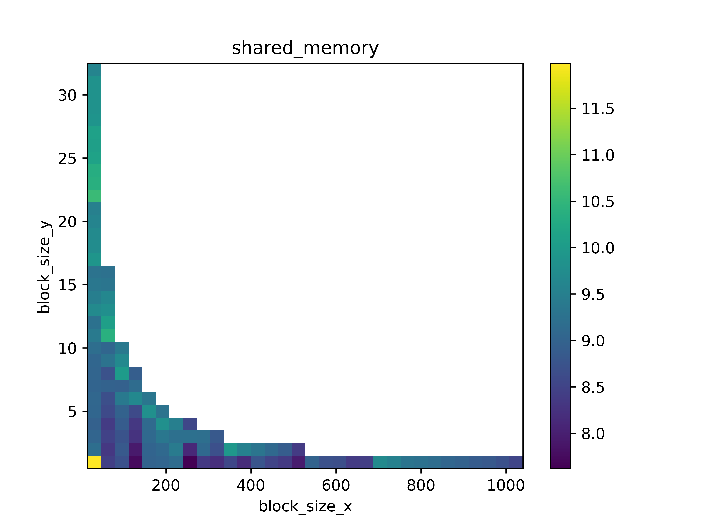

# exp6: CUDA 并行策略

## Performance

## Analysis

当 `block_size = 32 * 1` 时, `block_size` 过小, `grid` 数量过多, 导致调度产生的开销过大, 因此耗时较长.

在一些 `block_size` 取值处, 例如 `block_size = 32 * 16, 32 * 21` 等, `naive` 和 `shared_memory` 的性能都出现了较大幅度的跳变, 暂时想不出来为什么.

Shared Memory 带来的提升, 主要是通过增加内存访问时间以及 `__syncthreads` 开销, 以减少对同一元素重复调用 `calc` 方法. 当 `block_size` 较小时, `__syncthreads` 的开销较小, 因此 Shared Memory 能够带来一定的提升. 但随着 `block_size` 的增大, 同步的开销逐步增加, 导致 Shared Memory 带来的提升不明显, 甚至产生了负面影响.

事实上, 使用 Shared Memory 的实现对于每个 Thread 而言负载极不均衡. 位于边界的 Thread 需要进行数次 `calc`, 而位于 Block 内部的 Thread 只需要进行一次计算. 负载分配策略仍有优化空间. 除此之外, Shared Memory 实现使用了多次 `if`, 这也可能带来性能的损耗.

不难看出, Shared Memory 往往伴随着线程同步一起使用. 对于 CPU Bound 类型的程序, 通过划分较小的 `block_size`, 并使用 Shared Memory 优化, 应该能够有效提升程序性能. 而对于 Memory Bound 类型的程序, 使用 Shared Memory 减少重复计算显然得不偿失. 这时, Shared Memory 可能并不能带来性能的提升, 反而因为 Shared Memory 的访问速度限制使得程序性能更加糟糕.