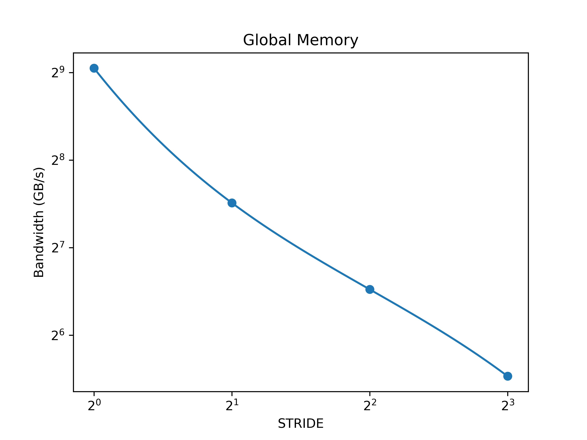
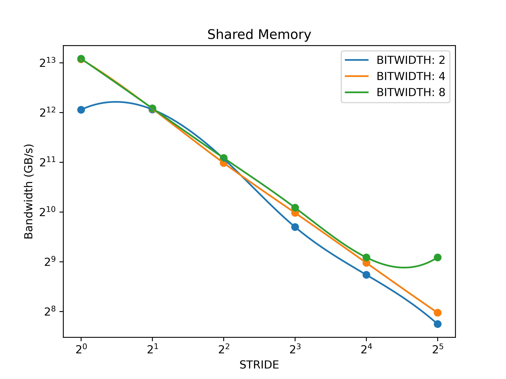

# exp7: CUDA 优化

## 分析 `test_gmem.cu` 的性能变化来源

```c++
__global__ void stride_copy(float *dst, float *src) {
  int i = blockIdx.x * blockDim.x + threadIdx.x;
  dst[i * STRIDE] = src[i * STRIDE];
}
```



### 性能变化的主要来源是 GPU 的哪种机制引起的？

访存合并机制.

### 这种机制如何影响该程序的性能？

在 DRAM, L2 cache, L1 cache 之间传输数据的最小单元为 1 sector = 32 Bytes. DRAM 访问总量为 `size * STRIDE * sizeof(float)` 与 `STRIDE` 成正比. 因此 `STRIDE` 越大, 程序访问的 transaction 个数越多, 且近似呈正比, 导致性能反比下降.

### 是否有其他的硬件功能参与了该程序的执行过程, 它们会如何影响该程序的执行效率？

cache. 顺序访问时, 数据会被缓存在 cache 中, 从而减少对 DRAM 的直接访问, 提升性能.

## 分析 `test_smem.cu` 的性能变化来源

```c++
__global__ void test_shmem() {
#if (BITWIDTH == 2)
  volatile __shared__ uint16_t shm[32 * 128];
  volatile uint16_t tmp;
#elif (BITWIDTH == 4)
  volatile __shared__ uint32_t shm[32 * 128];
  volatile uint32_t tmp;
#elif (BITWIDTH == 8)
  volatile __shared__ uint64_t shm[32 * 128];
  volatile uint64_t tmp;
#endif

  for (int i = 0; i < times; i++) {
    tmp = shm[threadIdx.x * STRIDE];
  }
}
```



### 固定 `BITWIDTH` 时, 程序的性能变化来源于哪种硬件机制？

bank conflict.

### `BITWIDTH` 设置为 2,8 时性能变化的趋势相比于 `BITWIDTH` 设置为 4 时有什么不同之处, 请解释.

`BITWIDTH` 设置为 4 时, bandwidth 随着 `STRIDE` 的增大而减小. `BITWIDTH` 设置为 2 时, `STRIDE` 为 1 和 2 时 bandwidth 几乎相等, 而后变化趋势与 `BITWIDTH` 设置为 4 时基本相同. `BITWIDTH` 设置为 8 时, `STRIDE` 为 16 和 32 时 bandwidth 几乎相等, 在这之前的变化趋势与 `BITWIDTH` 设置为 4 时基本相同.

当 `BITWIDTH` 为 4 时, 访存粒度为 4 Bytes = 1 bank, 相邻两个 thread 访问地址间隔为 `STRIDE` 个 bank. 当 `STRIDE` 为 1 时, 同一 wrap 内的 32 个 thread 访问了第一行内的 32 个bank, 不存在 bank conflict. 当 `STRIDE` 为 2 时, `threadIdx.x` 与 `threadIdx.x + 16` 访问同一 bank, 发生 2-way bank conflict. 当 `STRIDE` 为 4 时, `threadIdx.x`, `threadIdx.x + 8`, `threadIdx.x + 16`, `threadIdx.x + 24` 访问同一个 bank, 发生 4-way bank conflict. 类似的, `STRIDE` 为 8 和 16 时分别发生 8-way bank conflict 和 16-way bank conflict.

当 `BITWIDTH` 为 2, `STRIDE` 为 1 时, 相邻两个 thread 访问同一个 bank, 发生 2-way bank conflict, 共访问 16 个 bank. 而 `STRIDE` 为 2 时, 虽然没有 bank conflict, 但需要访问 32 个 bank. 但由于每次访问仅使用 0.5 bank, 带宽为理论峰值的一半. 因此 `STRIDE` 为 1 或 2 时性能相近.

当 `BITWIDTH` 为 8, `STIRDE` 为 16 时, 相邻两个 thread 访存地址间隔为 128 Bytes, 恰为一行. 这意味着, 所有 thread 都访问 bank-0 和 bank-1, 发生 32-way bank conflict. 而当 `STRIDE` 为 32 时, 相邻两个 thread 访存地址间隔为 256 Bytes, 为两行, 此时所有 thread 仍都访问 bank-0 和 bank-1, 发生 32-way bank conflict. 因此 `STRIDE` 为 16 或 32 时性能相近.

## Performance

### Global Memory

| Stride | Bandwidth (GB/s) |
| ------ | ---------------- |
| 1      | 530.015          |
| 2      | 182.471          |
| 4      | 91.9932          |
| 8      | 46.2866          |

### Shared Memory

| Bitwidth | Stride | Bandwidth (GB/s) |
| -------- | ------ | ---------------- |
| 2        | 1      | 4258.05          |
| 2        | 2      | 4270.88          |
| 2        | 4      | 2149.69          |
| 2        | 8      | 831.405          |
| 2        | 16     | 427.135          |
| 2        | 32     | 215.022          |
| 4        | 1      | 8607.33          |
| 4        | 2      | 4315.77          |
| 4        | 4      | 2027.46          |
| 4        | 8      | 1012.86          |
| 4        | 16     | 504.37           |
| 4        | 32     | 251.766          |
| 8        | 1      | 8657.57          |
| 8        | 2      | 4339.44          |
| 8        | 4      | 2173.55          |
| 8        | 8      | 1087.65          |
| 8        | 16     | 544.069          |
| 8        | 32     | 544.068          |
